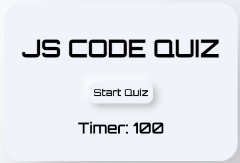
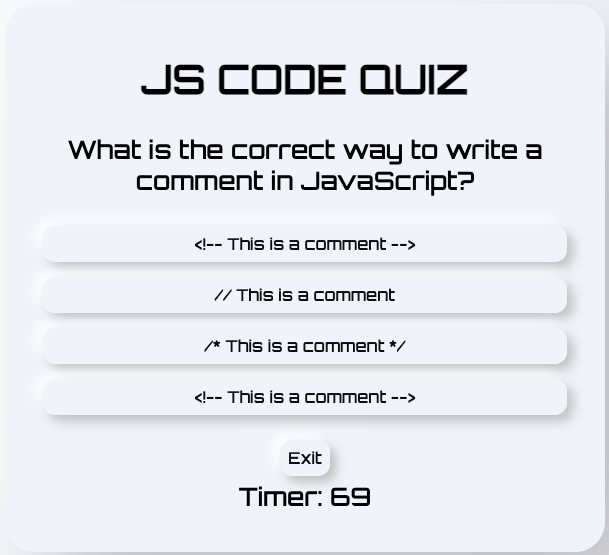
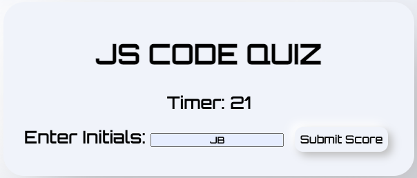
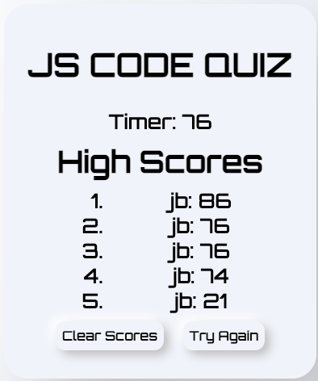

# JavaScript Code Quiz

## Description:
* I built a code quiz intended to provide users with a challenging and immersive experience. The objective was to enhance the difficulty level and create a sense of pressure for those taking the quiz.  I wanted to ensure a level of difficulty just in case they find the multiple choice questions too easy.  

* In order to achieve this, I incorporated several features to intensify the code quiz. These included a tilt feature and neumorphism buttons to disorient the user, a font that is intentionally difficult to read and a moving marquee in the background to create distractions.

* I have found that this code quiz helped me understand the basic JavaScript fundamentals.  Serves as an excellent tool for students to improve their studying experience and grasp the core concepts more effectively.

* In the end, completing this assignment allowed me to practice and was always reminded and encouraged to have side projects and I thought that this would be the perfect time to exercise my new skills and in the process I discovered that I am becoming more of a frontend developer because I tend to explore my creativity with this assignment and past assignments. Unfortunately, I still face challenges with JavaScript and I know it's going to take some more time and all the resources I have is out there and are endless which I am making the most of to my advantage.

## Installation:
* On a web browser please follow the link to begin exploring. [JavaScript Code Quiz.](https://junel-balbin.github.io/BC4-Code-Quiz/)

* Accessible on any mobile device and tablet.

## Usage:

* Take a moment to read the scrolling "RULE" marquee located on the header. If the scrolling speed is too fast, you have the option to click and pause the marquee allowing you to read its contents fully.

* Above image displays the Start Quiz.  Click or press to begin.

* Above image displays the multiple choice questions.  

* Above image displays the Initials input and allows you to submit your score.

* Above image displays the High Scores listed in descending order with the highest at the top.

## Credits & Resources:

* Idea snippets and notes from EdX and UCB.

* Google search, Stack Overflow search. Youtube videos. Bard & ChatGpt for troubleshooting.

* [Neumorphism Generator 1.](https://neumorphism.io/#e0e0e0)

* [Neumorphism Generator 2.](https://hype4.academy/tools/neumorphism-generator)

* [Vanilla Script Tilt Feature.](https://micku7zu.github.io/vanilla-tilt.js/)

* [Responsive Marquee.](https://youtu.be/OJ6byQDF9-Y)

## Contributing:
* Any ideas or feedback is very much appreciated.

## License:
* MIT License.

